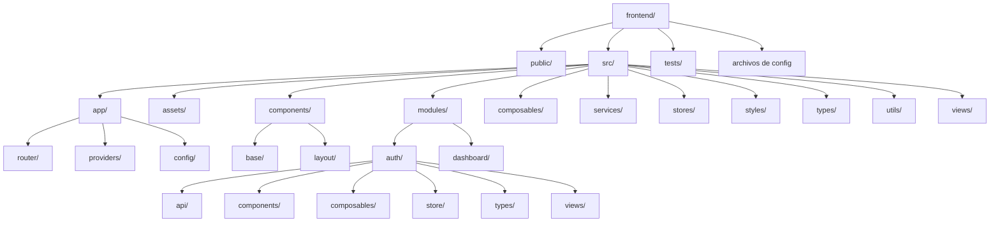
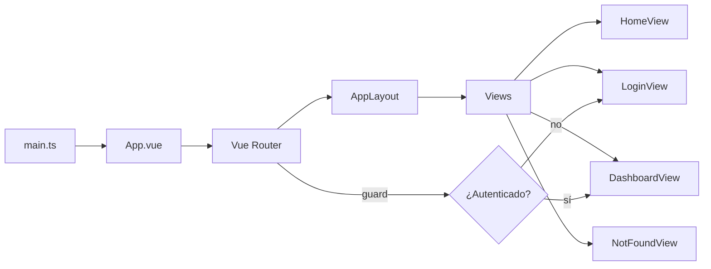
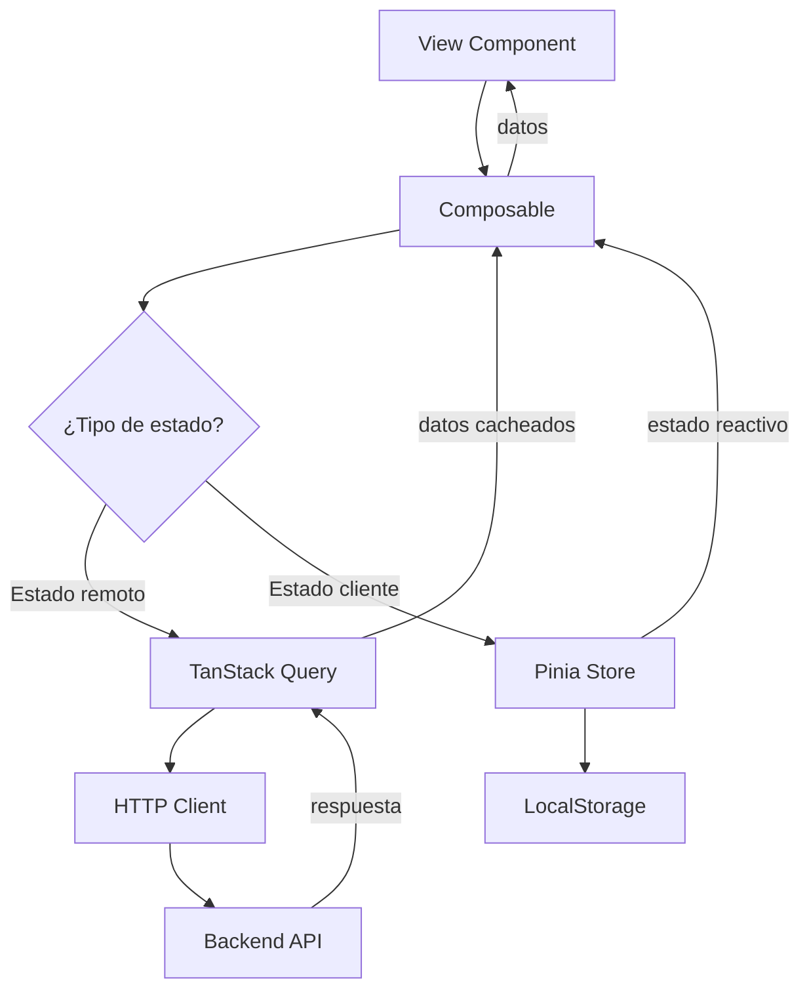
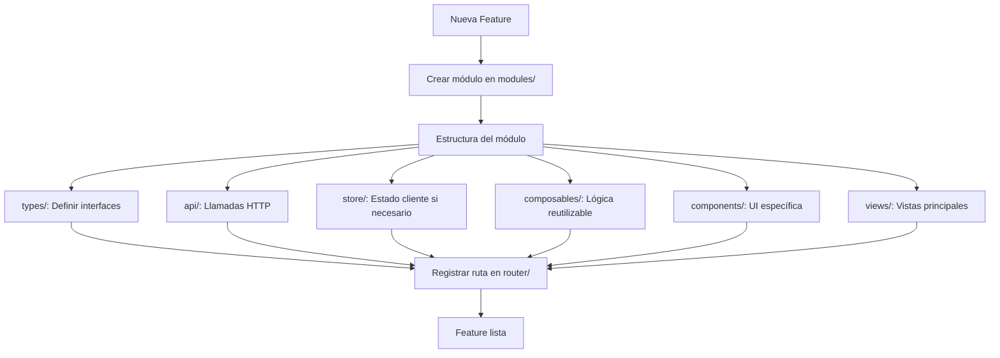

# Guía Completa del Boilerplate Vue 3

## 📖 Propósito del Boilerplate

Este boilerplate está diseñado para ser tu punto de partida en proyectos Vue 3 profesionales. No es un framework complejo ni una solución enterprise sobrediseñada. Es una base **clara, mantenible y escalable** que te permite empezar a construir features de inmediato sin perder tiempo en configuración.

## 🎯 Filosofía de Diseño

### Principios fundamentales

1. **Minimalismo funcional**: Solo incluye lo necesario, pero todo lo necesario
2. **Claridad sobre cleverness**: Código fácil de leer y entender
3. **Escalabilidad progresiva**: Crece con tu proyecto sin necesidad de refactorizar
4. **Separación de responsabilidades**: Cada cosa en su lugar
5. **TypeScript estricto**: Seguridad de tipos sin compromisos

### Lo que NO es este boilerplate

- ❌ No es un framework opinionado que te obliga a hacer las cosas de una manera específica
- ❌ No incluye librerías UI pesadas que luego tendrás que reemplazar
- ❌ No tiene abstracciones complejas que dificultan entender qué está pasando
- ❌ No está sobreingeniado para casos de uso que probablemente nunca necesites

## 🏗️ Arquitectura del Proyecto

### Diagrama de Estructura



### Diagrama de Flujo de Navegación



### Diagrama de Flujo de Datos



### Diagrama de Crecimiento de un Módulo



## 📂 Explicación de Carpetas

### `src/app/`

**Propósito**: Configuración central de la aplicación.

- **`router/`**: Definición de rutas y guards de navegación
- **`providers/`**: Registro de plugins globales (Pinia, Router, VueQuery)
- **`config/`**: Variables de entorno tipadas y configuración global

**Cuándo usar**: Solo para configuración que afecta a toda la app. No pongas lógica de negocio aquí.

### `src/components/`

**Propósito**: Componentes reutilizables que no pertenecen a un módulo específico.

- **`base/`**: Componentes primitivos (botones, inputs, cards) usados en toda la app
- **`layout/`**: Layouts y estructuras de página (headers, sidebars, footers)

**Cuándo usar**: Para componentes que usarás en múltiples módulos. Si un componente solo se usa en un módulo, ponlo en `modules/[modulo]/components/`.

### `src/modules/`

**Propósito**: Organización por dominio de negocio. Cada módulo es una feature completa.

**Estructura de un módulo**:

```
modules/
  auth/
    api/          # Funciones que llaman al backend
    components/   # Componentes específicos de este módulo
    composables/  # Lógica reutilizable con vue-query
    store/        # Estado de cliente (Pinia)
    types/        # Interfaces TypeScript
    views/        # Vistas/páginas del módulo
```

**Cuándo usar**: Para cualquier feature que tenga entidad propia. Ejemplos: `auth`, `users`, `products`, `orders`, etc.

**Ventaja**: Puedes copiar un módulo completo a otro proyecto o eliminarlo sin afectar el resto.

### `src/services/`

**Propósito**: Servicios transversales que no son específicos de un módulo.

- **`http/`**: Cliente HTTP centralizado con interceptors y manejo de errores

**Cuándo usar**: Para servicios que múltiples módulos necesitan. Ejemplos: HTTP client, WebSocket manager, analytics, etc.

### `src/stores/`

**Propósito**: Stores de Pinia globales que no pertenecen a un módulo específico.

**Cuándo usar**: Para estado de UI global (tema, idioma, notificaciones). Si el estado es específico de un módulo, ponlo en `modules/[modulo]/store/`.

### `src/composables/`

**Propósito**: Composables reutilizables que no pertenecen a un módulo.

**Cuándo usar**: Para lógica que se reutiliza en múltiples módulos. Ejemplos: `useBreakpoints`, `useDebounce`, `useLocalStorage`.

### `src/views/`

**Propósito**: Vistas principales que no pertenecen a un módulo específico.

**Cuándo usar**: Para páginas genéricas como `HomeView`, `NotFoundView`, `AboutView`.

### `src/types/`

**Propósito**: Tipos TypeScript globales compartidos.

**Cuándo usar**: Para interfaces que se usan en múltiples módulos. Ejemplos: `ApiResponse`, `PaginatedResponse`.

### `src/utils/`

**Propósito**: Funciones utilitarias puras sin dependencias de Vue.

**Cuándo usar**: Para helpers que podrían funcionar en cualquier proyecto JS/TS. Ejemplos: `formatDate`, `debounce`, `truncate`.

## 🔄 Estado: Global vs Remoto vs UI

### ¿Cuándo usar Pinia?

**Pinia es para estado de cliente** que necesitas compartir entre componentes:

- ✅ Sesión de usuario (token, info básica)
- ✅ Preferencias de UI (tema, idioma)
- ✅ Estado de navegación
- ✅ Datos que el usuario modifica localmente

**Ejemplo**: Store de autenticación

```typescript
// modules/auth/store/auth.store.ts
export const useAuthStore = defineStore('auth', () => {
  const user = ref<User | null>(null)
  const token = ref<string | null>(null)
  
  function setAuth(newToken: string, newUser: User) {
    token.value = newToken
    user.value = newUser
    localStorage.setItem('auth_token', newToken)
  }
  
  return { user, token, setAuth }
})
```

### ¿Cuándo usar TanStack Query (vue-query)?

**TanStack Query es para estado remoto** que viene del backend:

- ✅ Datos de API (usuarios, productos, pedidos)
- ✅ Listas que se cargan del servidor
- ✅ Datos que necesitan caché
- ✅ Datos que se recargan automáticamente

**Ejemplo**: Composable con vue-query

```typescript
// modules/dashboard/composables/useDashboard.ts
export function useDashboard() {
  const { data, isLoading, error } = useQuery({
    queryKey: ['dashboard', 'stats'],
    queryFn: () => httpClient.get('/dashboard/stats'),
    staleTime: 1000 * 60 * 5, // 5 minutos
  })
  
  return { stats: data, isLoading, error }
}
```

### Regla de oro

- **Pinia**: Estado que TÚ controlas (cliente)
- **TanStack Query**: Estado que el BACKEND controla (servidor)

## 🚀 Cómo Crear una Nueva Feature

### Paso 1: Crear el módulo

```bash
mkdir -p src/modules/products/{api,components,composables,store,types,views}
```

### Paso 2: Definir tipos

```typescript
// src/modules/products/types/product.types.ts
export interface Product {
  id: string
  name: string
  price: number
  description: string
}
```

### Paso 3: Crear API

```typescript
// src/modules/products/api/products.api.ts
import { httpClient } from '@/services/http/client'
import type { Product } from '../types/product.types'

export const productsApi = {
  getAll: () => httpClient.get<Product[]>('/products'),
  getById: (id: string) => httpClient.get<Product>(`/products/${id}`),
  create: (data: Omit<Product, 'id'>) => 
    httpClient.post<Product>('/products', data),
}
```

### Paso 4: Crear composable

```typescript
// src/modules/products/composables/useProducts.ts
import { useQuery } from '@tanstack/vue-query'
import { productsApi } from '../api/products.api'

export function useProducts() {
  const { data, isLoading, error } = useQuery({
    queryKey: ['products'],
    queryFn: productsApi.getAll,
  })
  
  return { products: data, isLoading, error }
}
```

### Paso 5: Crear vista

```vue
<!-- src/modules/products/views/ProductsView.vue -->
<template>
  <AppLayout>
    <h1>Productos</h1>
    <div v-if="isLoading">Cargando...</div>
    <div v-else-if="error">Error: {{ error }}</div>
    <div v-else>
      <ProductCard 
        v-for="product in products" 
        :key="product.id"
        :product="product"
      />
    </div>
  </AppLayout>
</template>

<script setup lang="ts">
import { useProducts } from '../composables/useProducts'
import AppLayout from '@/components/layout/AppLayout.vue'

const { products, isLoading, error } = useProducts()
</script>
```

### Paso 6: Registrar ruta

```typescript
// src/app/router/index.ts
{
  path: '/products',
  name: 'products',
  component: () => import('@/modules/products/views/ProductsView.vue'),
}
```

## 🔌 Cómo Agregar una Nueva Vista

### Vista simple (sin módulo)

```vue
<!-- src/views/AboutView.vue -->
<template>
  <AppLayout>
    <h1>Acerca de</h1>
    <p>Información sobre la aplicación</p>
  </AppLayout>
</template>

<script setup lang="ts">
import AppLayout from '@/components/layout/AppLayout.vue'
</script>
```

Registra en el router:

```typescript
{
  path: '/about',
  name: 'about',
  component: () => import('@/views/AboutView.vue'),
}
```

### Vista con datos (dentro de módulo)

Sigue los pasos de "Cómo Crear una Nueva Feature" arriba.

## 🌐 Cómo Agregar una Nueva Llamada HTTP

### Opción 1: En un módulo existente

```typescript
// src/modules/auth/api/auth.api.ts
export const authApi = {
  // ... métodos existentes
  
  resetPassword: (email: string) => 
    httpClient.post('/auth/reset-password', { email }),
}
```

### Opción 2: Nuevo módulo

Crea la estructura completa como se explicó en "Cómo Crear una Nueva Feature".

### Opción 3: Llamada directa (no recomendado para producción)

```typescript
import { httpClient } from '@/services/http/client'

const data = await httpClient.get('/some-endpoint')
```

**Nota**: Siempre prefiere encapsular las llamadas en archivos `api/` para mantener el código organizado.

## 📈 Cómo Escalar el Proyecto

### Añadir más módulos

```
src/modules/
  auth/
  dashboard/
  products/      # Nuevo
  orders/        # Nuevo
  customers/     # Nuevo
  analytics/     # Nuevo
```

Cada módulo es independiente y sigue la misma estructura.

### Añadir submódulos

Si un módulo crece mucho, puedes crear submódulos:

```
src/modules/
  ecommerce/
    products/
      api/
      components/
      views/
    orders/
      api/
      components/
      views/
    cart/
      api/
      components/
      views/
```

### Añadir más composables globales

```typescript
// src/composables/useBreakpoints.ts
export function useBreakpoints() {
  // Lógica para detectar breakpoints
}

// src/composables/useDebounce.ts
export function useDebounce(value: Ref<string>, delay: number) {
  // Lógica de debounce
}
```

### Añadir más componentes base

```vue
<!-- src/components/base/BaseInput.vue -->
<template>
  <input :type="type" :value="modelValue" @input="handleInput" />
</template>

<!-- src/components/base/BaseCard.vue -->
<template>
  <div class="bg-white rounded-lg shadow p-6">
    <slot />
  </div>
</template>
```

## ⚠️ Errores Comunes a Evitar

### 1. Mezclar estado de cliente con estado remoto

❌ **Mal**:

```typescript
// Guardar datos del backend en Pinia
const productsStore = defineStore('products', () => {
  const products = ref([])
  
  async function fetchProducts() {
    const data = await httpClient.get('/products')
    products.value = data
  }
  
  return { products, fetchProducts }
})
```

✅ **Bien**:

```typescript
// Usar TanStack Query para datos del backend
export function useProducts() {
  return useQuery({
    queryKey: ['products'],
    queryFn: () => httpClient.get('/products'),
  })
}
```

### 2. Poner lógica de negocio en componentes

❌ **Mal**:

```vue
<script setup>
const products = ref([])
const isLoading = ref(false)

onMounted(async () => {
  isLoading.value = true
  try {
    const response = await fetch('/api/products')
    products.value = await response.json()
  } finally {
    isLoading.value = false
  }
})
</script>
```

✅ **Bien**:

```vue
<script setup>
import { useProducts } from '@/modules/products/composables/useProducts'

const { products, isLoading } = useProducts()
</script>
```

### 3. Crear componentes demasiado genéricos desde el inicio

❌ **Mal**: Crear `BaseTable.vue` con 50 props antes de necesitarlo

✅ **Bien**: Crear componentes específicos primero, extraer lo común después

### 4. No usar TypeScript correctamente

❌ **Mal**:

```typescript
const data: any = await httpClient.get('/products')
```

✅ **Bien**:

```typescript
const data = await httpClient.get<Product[]>('/products')
```

### 5. Ignorar la estructura de módulos

❌ **Mal**: Poner todo en `src/components/` o `src/views/`

✅ **Bien**: Organizar por dominio en `src/modules/`

### 6. Hardcodear URLs del backend

❌ **Mal**:

```typescript
fetch('https://api.example.com/products')
```

✅ **Bien**:

```typescript
httpClient.get('/products') // Usa baseURL de env.ts
```

## 💡 Recomendaciones Iniciales

### 1. Empieza simple

No crees abstracciones hasta que las necesites. Duplica código al principio, extrae patrones después.

### 2. Un módulo = una feature

Si estás trabajando en "gestión de usuarios", crea `modules/users/`. Si es "carrito de compras", crea `modules/cart/`.

### 3. Mantén los componentes pequeños

Si un componente tiene más de 200 líneas, probablemente puedas dividirlo.

### 4. Usa composables para lógica reutilizable

Si copias y pegas lógica entre componentes, es hora de crear un composable.

### 5. Tipado estricto desde el inicio

Define interfaces para todo lo que venga del backend. Te ahorrará bugs después.

### 6. Tests para lógica crítica

No necesitas 100% de cobertura, pero testa stores, composables y funciones críticas.

### 7. Commits atómicos

Haz commits pequeños y frecuentes. Facilita el code review y el debugging.

## 🎓 Cómo Empezar mi Siguiente Feature

### Ejemplo práctico: Sistema de notificaciones

**Paso 1: Planifica**

- ¿Qué datos necesito? → `Notification { id, message, type, read }`
- ¿De dónde vienen? → Backend API
- ¿Necesito estado global? → Sí, para mostrar notificaciones en toda la app

**Paso 2: Crea la estructura**

```bash
mkdir -p src/modules/notifications/{api,components,composables,types,views}
```

**Paso 3: Define tipos**

```typescript
// src/modules/notifications/types/notification.types.ts
export interface Notification {
  id: string
  message: string
  type: 'info' | 'success' | 'warning' | 'error'
  read: boolean
  createdAt: string
}
```

**Paso 4: Crea API**

```typescript
// src/modules/notifications/api/notifications.api.ts
import { httpClient } from '@/services/http/client'
import type { Notification } from '../types/notification.types'

export const notificationsApi = {
  getAll: () => httpClient.get<Notification[]>('/notifications'),
  markAsRead: (id: string) => 
    httpClient.patch(`/notifications/${id}/read`),
}
```

**Paso 5: Crea composable**

```typescript
// src/modules/notifications/composables/useNotifications.ts
import { useQuery, useMutation } from '@tanstack/vue-query'
import { notificationsApi } from '../api/notifications.api'

export function useNotifications() {
  const { data, refetch } = useQuery({
    queryKey: ['notifications'],
    queryFn: notificationsApi.getAll,
    refetchInterval: 30000, // Recargar cada 30s
  })
  
  const markAsReadMutation = useMutation({
    mutationFn: notificationsApi.markAsRead,
    onSuccess: () => refetch(),
  })
  
  return {
    notifications: data,
    markAsRead: markAsReadMutation.mutate,
  }
}
```

**Paso 6: Crea componente**

```vue
<!-- src/modules/notifications/components/NotificationBell.vue -->
<template>
  <button @click="toggleDropdown" class="relative">
    <BellIcon />
    <span v-if="unreadCount > 0" class="badge">
      {{ unreadCount }}
    </span>
  </button>
  
  <div v-if="isOpen" class="dropdown">
    <NotificationItem 
      v-for="notif in notifications" 
      :key="notif.id"
      :notification="notif"
      @click="markAsRead(notif.id)"
    />
  </div>
</template>

<script setup lang="ts">
import { ref, computed } from 'vue'
import { useNotifications } from '../composables/useNotifications'

const { notifications, markAsRead } = useNotifications()
const isOpen = ref(false)

const unreadCount = computed(() => 
  notifications.value?.filter(n => !n.read).length ?? 0
)

const toggleDropdown = () => {
  isOpen.value = !isOpen.value
}
</script>
```

**Paso 7: Integra en el layout**

```vue
<!-- src/components/layout/AppLayout.vue -->
<template>
  <header>
    <nav>
      <!-- ... -->
      <NotificationBell />
    </nav>
  </header>
</template>

<script setup lang="ts">
import NotificationBell from '@/modules/notifications/components/NotificationBell.vue'
</script>
```

**¡Listo!** Tienes un sistema de notificaciones completo, organizado y escalable.

---

## 🎯 Conclusión

Este boilerplate te da una base sólida sin atarte las manos. Sigue los patrones establecidos, pero no tengas miedo de adaptarlos a tus necesidades. La clave es mantener el código **organizado**, **tipado** y **fácil de entender**.

¡Feliz coding! 🚀
